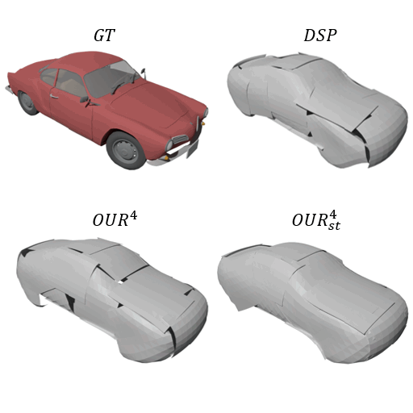
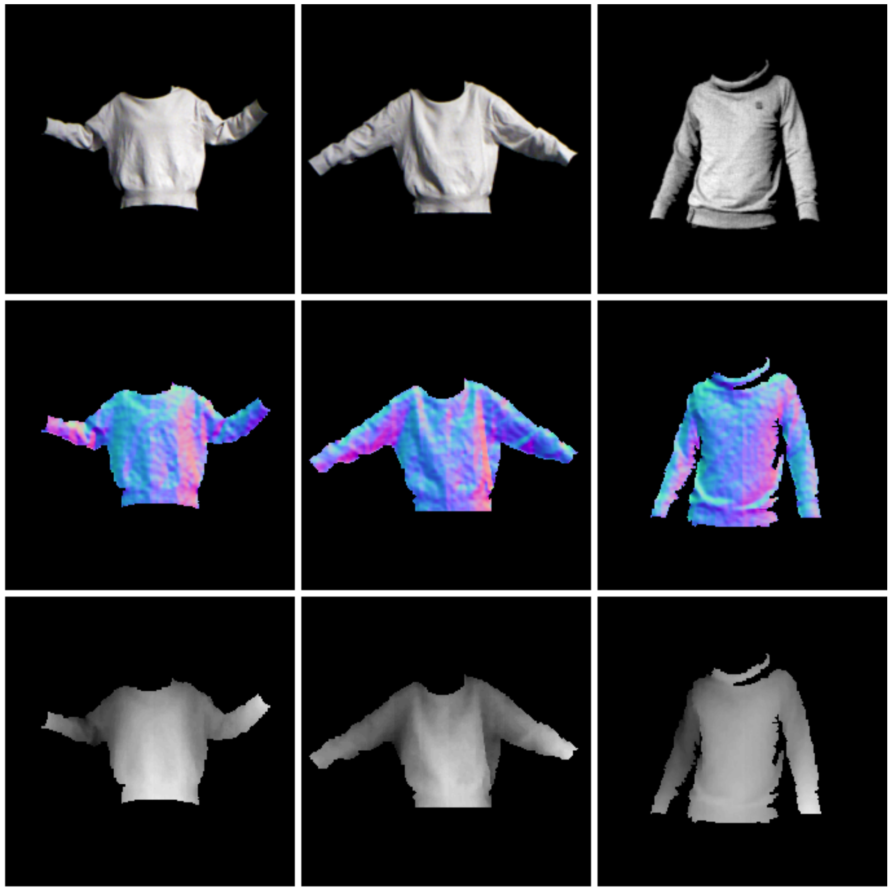

    

        

        
        

    

    

        
 I am Jan, a PhD candidate at <a href="https://www.epfl.ch/labs/cvlab/">CVLab</a>, <a href="https://www.epfl.ch/en/">EPFL</a> (Lausanne, Switzerland), where I work under supervision of Prof. <a href="https://people.epfl.ch/pascal.fua/bio">Pascal Fua</a> and Dr <a href="https://people.epfl.ch/mathieu.salzmann">Mathieu Sazlmann</a>. My PhD revolves around 3D vision with a particular focus on deformable surface reconstruction and representaiton learning. My main research interests include geometric deep learning, differential geometry, shape-from-X and shape representation.

In summer 2020 during my Adobe Research internship I had a chance to join the team of <a href="https://noamaig.github.io/">Noam Aigerman</a>, <a href="http://www.vovakim.com/">Vladimir Kim</a> and <a href="https://www.cse.iitb.ac.in/~sidch/">Siddhartha Chaudhuri</a>. Before starting my PhD at CVLab at EPFL, I studied at <a href="https://www.fit.vut.cz/.en">Brno University of Technology</a> (Brno, Czechia), where I obtained my M.Sc. degree in computer science. During my undergraduate studies in 2013 I spent five months at <a href="https://www.ntnu.no/">Norwegian Univesity of Science and Tehchnology</a> (Trondheim, Norway) as an exchange student.     
        

    

<h2 class="spanswhole" style="text-align: center;">Publications</h2>
<table class="invisible_table" >
<tr><th>

</th><th></th></tr>

<tr><td  style="padding-right:10px">
    
    </td>
    <td>
        
<h3>Temporally-Consistent Surface Reconstruction using Metrically-Consistent Atlases</h3>

        
<a href="https://arxiv.org/abs/2104.06950">[Paper (ICCV)] </a> <a href="https://arxiv.org/abs/2111.06838">[Paper (extension)] </a> <a href="https://github.com/bednarikjan/temporally_coherent_surface_reconstruction">[Code]</a> <a href="https://bednarikjan.github.io/projects/temp_cons_surf_rec/">[Project page]</a> <a href="https://www.youtube.com/watch?v=P4imXONmtto&t=12s&ab_channel=JanBedna%C5%99%C3%ADk">[Video]</a>

        
<b>Jan Bednarik</b>, Noam Aigerman, Vladimir G. Kim, Siddhartha Chaudhuri, Shaifali Parashar, Mathieu Salzmann, Pascal Fua

        
<i>ICCV 2021, extension under review</i>

        
We propose a method for unsupervised reconstruction of a temporally-consistent sequence of surfaces from a sequence of time-evolving point clouds. It yields dense and semantically meaningful correspondences between frames. We have devised an optimization strategy that makes our method robust to noise and global motions, without a priori correspondences or pre-alignment steps. As a result, our approach outperforms state-of-the-art ones on several challenging datasets.

</td></tr>

<tr><td  style="padding-right:10px">
    
    </td>
    <td>
        
<h3>Better Patch Stitching for Parametric Surface Reconstruction</h3>

        
<a href="https://arxiv.org/abs/2010.07021">[Paper] </a> <a href="https://github.com/bednarikjan/Better-Patch-Stitching">[Code]</a> <a href="https://crossminds.ai/video/better-patch-stitching-for-parametric-surface-reconstruction-6046f6fcde447367726cf6a0/">[Video]</a>

        
Zhantao Deng, <b>Jan Bednarik</b>, Mathieu Salzmann, Pascal Fua

        
<i>3DV 2020</i>

        
Ensembles of parametric mappings have emerged as highly effective surface representations yielding low reconstruction errors. However, the representaion suffers from global inconsistency among the individual mappings leading to undesirable surface artifacts such as holes jaggedness in the overallping areas. We introduce an approach that explicitly encourages global consistency of the local mappings through novel loss terms forcing the mapping ensemble towards a C1 smooth function. Our approach yields better surface normals and much improved visual quality of the reconstructed objects.

</td></tr>

<tr><td  style="padding-right:10px">
    
    </td>
    <td>
        
<h3>Shape Reconstruction by Learning Differentiable Surface Representations</h3>

        
<a href="https://arxiv.org/abs/1911.11227">[Paper] </a> <a href="https://github.com/bednarikjan/differential_surface_representation">[Code]</a> 

        
<b>Jan Bednarik</b>, Shaifali Parashar, Erhan Gundogdu, Mathieu Salzmann, Pascal Fua

        
<i>CVPR 2020</i>

        
  Generative models that produce point clouds have emerged as a powerful tool to represent 3D surfaces, and the best current ones rely on learning an ensemble of parametric representations. Unfortunately, they offer no control over the deformations of the surface patches that form the ensemble and thus fail to prevent them from either overlapping or collapsing into single points or lines. In this paper, we show that we can exploit the inherent differentiability of deep networks to leverage differential surface properties during training so as to prevent patch collapse and strongly reduce patch overlap.

</td></tr>

<tr><td  style="padding-right:10px">
    
    </td>
    <td>
        
<h3>Learning to Reconstruct Texture-less Deformable Surfaces from a Single View</h3>

        
<a href="https://arxiv.org/abs/1803.08908">[Paper] </a> <a href="https://github.com/bednarikjan/texless_defsurf_recon">[Code]</a> 

        
<b>Jan Bednarik</b>, Mathieu Salzmann, Pascal Fua

        
<i>3DV 2018</i>

        
Recent years have seen the development of mature solutions for reconstructing deformable surfaces from a single image, provided that they are relatively well-textured. By contrast, recovering the 3D shape of texture-less surfaces remains an open problem, and essentially relates to Shape-from-Shading. In this paper, we introduce a data-driven multi-task approach to this problem. Our reconstructions accurately model the fine details of the surfaces, such as the creases of a T-Shirt worn by a person.

</td></tr>

</table>
