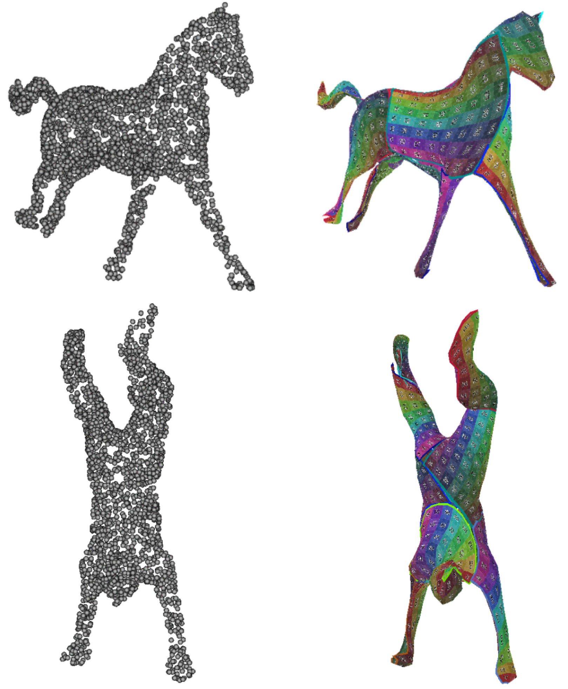

    

        

        
        

    

    

        
 My name is Jan Bednarik, info info info...
        

    

<table class="invisible_table" >
<tr><th>

<h2 class="spanswhole">Publications:</h2>
</th><th></th></tr>

<tr><td  style="padding-right:10px">
    
    </td>
    <td>
        
<h3>Temporally-Consistent Surface Reconstruction using Metrically-Consistent Atlases</h3>

        
<a href="https://arxiv.org/abs/2104.06950">[Paper (ICCV)] </a> <a href="https://arxiv.org/abs/2111.06838">[Paper (extension)] </a> <a href="https://github.com/bednarikjan/temporally_coherent_surface_reconstruction">[Code]</a> <a href="https://bednarikjan.github.io/projects/temp_cons_surf_rec/">[Project page]</a> <a href="https://www.youtube.com/watch?v=P4imXONmtto&t=12s&ab_channel=JanBedna%C5%99%C3%ADk">[Video]</a>

        
<b>Jan Bednarik</b>, Noam Aigerman, Vladimir G. Kim, Siddhartha Chaudhuri, Shaifali Parashar, Mathieu Salzmann, Pascal Fua

        
<i>ICCV 2021, extension under review</i>

        
We propose a method for unsupervised reconstruction of a temporally-consistent sequence of surfaces from a sequence of time-evolving point clouds. It yields dense and semantically meaningful correspondences between frames. We have devised an optimization strategy that makes our method robust to noise and global motions, without a priori correspondences or pre-alignment steps. As a result, our approach outperforms state-of-the-art ones on several challenging datasets.

</td></tr>

<tr><td  style="padding-right:10px">
    
    </td>
    <td>
        
<h3>Better Patch Stitching for Parametric Surface Reconstruction</h3>

        
<a href="https://arxiv.org/abs/2010.07021">[Paper] </a> <a href="imgs/teaser_better_patch_stitching.gif">[Code]</a> <a href="https://crossminds.ai/video/better-patch-stitching-for-parametric-surface-reconstruction-6046f6fcde447367726cf6a0/">[Video]</a>

        
Zhantao Deng, <b>Jan Bednarik</b>, Mathieu Salzmann, Pascal Fua

        
<i>3DV 2020</i>

        
Ensembles of parametric mappings have emerged as highly effective surface representations yielding low reconstruction errors. However, the representaion suffer from global inconsistency among the individual mappings leading to undesirable surface artifacts such as holes jaggedness in the overallping areas. We introduce an approach that explicitly encourages global consistency of the local mappings through novel loss terms forcing the mapping ensemble towards a C1 smooth function. Our approach yields better surface normals and much improved visual quality of the reconstructed objects.

</td></tr>

</table>
