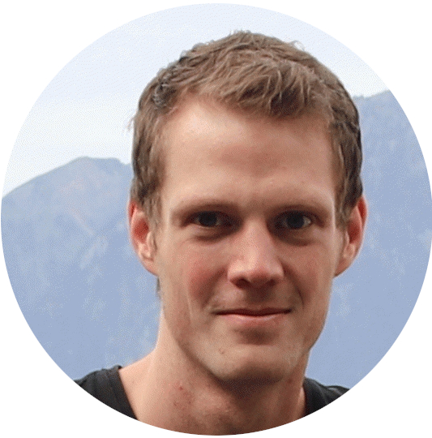
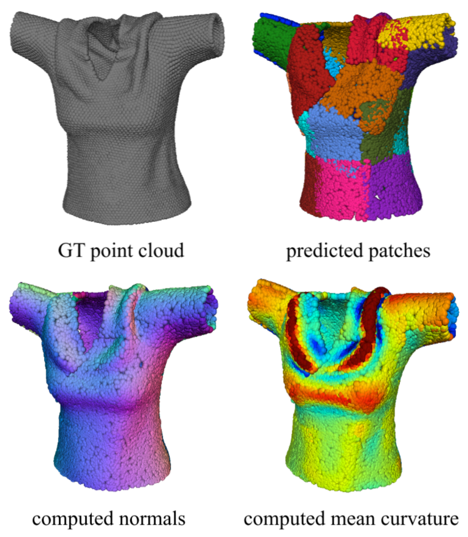

    

        

        
        

    

    

        
 I am Jan, a PhD candidate at <a href="https://www.epfl.ch/labs/cvlab/">CVLab</a>, <a href="https://www.epfl.ch/en/">EPFL</a>, working under supervision of Prof. <a href="https://people.epfl.ch/pascal.fua/bio">Pascal Fua</a> and Dr <a href="https://people.epfl.ch/mathieu.salzmann">Mathieu Sazlmann</a>. My PhD revolves around 3D vision with a particular focus on deformable surface reconstruction and representaiton learning. My main research interests include geometric deep learning, differential geometry, shape-from-X and shape representation.

In summer 2020 during my Adobe Research internship I had a chance to join the team of <a href="https://noamaig.github.io/">Noam Aigerman</a>, <a href="http://www.vovakim.com/">Vladimir Kim</a> and <a href="https://www.cse.iitb.ac.in/~sidch/">Siddhartha Chaudhuri</a>. Before starting my PhD, I studied at <a href="https://www.fit.vut.cz/.en">Brno University of Technology</a> (Brno, Czechia), where I obtained my M.Sc. degree in computer science. In 2013 I spent five months at <a href="https://www.ntnu.no/">Norwegian Univesity of Science and Tehchnology</a> (Trondheim, Norway) as an exchange student.     
        

    

<table class="invisible_table" >
<tr><th>
<h2 class="spanswhole" style="text-align: center;">Publications</h2>
</th><th></th></tr>

<tr><td  style="padding-right:10px">
    
    </td>
    <td>
        
<h3>Temporally-Consistent Surface Reconstruction using Metrically-Consistent Atlases</h3>

        
<a href="https://arxiv.org/abs/2104.06950">[Paper (ICCV)] </a> <a href="https://arxiv.org/abs/2111.06838">[Paper (extension)] </a> <a href="https://github.com/bednarikjan/temporally_coherent_surface_reconstruction">[Code]</a> <a href="https://bednarikjan.github.io/projects/temp_cons_surf_rec/">[Project page]</a> <a href="https://www.youtube.com/watch?v=P4imXONmtto&t=12s&ab_channel=JanBedna%C5%99%C3%ADk">[Video]</a>

        
<b>Jan Bednarik</b>, Noam Aigerman, Vladimir G. Kim, Siddhartha Chaudhuri, Shaifali Parashar, Mathieu Salzmann, Pascal Fua

        
<i>ICCV 2021, extension under review</i>

        
We propose a method for unsupervised reconstruction of a temporally-consistent sequence of surfaces from a sequence of time-evolving point clouds. The approach yields dense and semantically meaningful correspondences between frames and it is robust against strong shape deformations and global transformations.

</td></tr>

<tr><td  style="padding-right:10px">
    
    </td>
    <td>
        
<h3>Better Patch Stitching for Parametric Surface Reconstruction</h3>

        
<a href="https://arxiv.org/abs/2010.07021">[Paper] </a> <a href="https://github.com/bednarikjan/Better-Patch-Stitching">[Code]</a> <a href="https://crossminds.ai/video/better-patch-stitching-for-parametric-surface-reconstruction-6046f6fcde447367726cf6a0/">[Video]</a>

        
Zhantao Deng, <b>Jan Bednarik</b>, Mathieu Salzmann, Pascal Fua

        
<i>3DV 2020</i>

        
Atlas-based 3D surface representation is highly effective in terms of reconstruction error, however,it suffers from global inconsistency among the individual mappings leading to undesirable visual surface artifacts due to surface holes and jaggedness. This work introduces an approach to alleviate such problems so as to yield better reconstructions. 

</td></tr>

<tr><td  style="padding-right:10px">
    
    </td>
    <td>
        
<h3>Shape Reconstruction by Learning Differentiable Surface Representations</h3>

        
<a href="https://arxiv.org/abs/1911.11227">[Paper] </a> <a href="https://github.com/bednarikjan/differential_surface_representation">[Code]</a> 

        
<b>Jan Bednarik</b>, Shaifali Parashar, Erhan Gundogdu, Mathieu Salzmann, Pascal Fua

        
<i>CVPR 2020</i>

        
 This work focuses on some of the drawbacks of basic atlas-based shape representation. It leverages differential geometry to analytically compute essential properties of the reconstructed surfaces and use them to regularize the trained model. The approach thus allows for tight control over the mapping distortion, it prevents patch collapse and alleviates patch overlap. 

</td></tr>

<tr><td  style="padding-right:10px">
    
    </td>
    <td>
        
<h3>Learning to Reconstruct Texture-less Deformable Surfaces from a Single View</h3>

        
<a href="https://arxiv.org/abs/1803.08908">[Paper] </a> <a href="https://github.com/bednarikjan/texless_defsurf_recon">[Code]</a> 

        
<b>Jan Bednarik</b>, Mathieu Salzmann, Pascal Fua

        
<i>3DV 2018</i>

        
We introduce a multi-task approach to monocular reconstruction of texture-less deformable surfaces. The model leverages supervision by various available output shape modalities including depth maps, normal maps and meshes. Our approach outperforms a competing optimization based method on a custom real-world dataset of deformable shapes such as a T-Shirt or a sweater worn by a person.

</td></tr>

</table>
